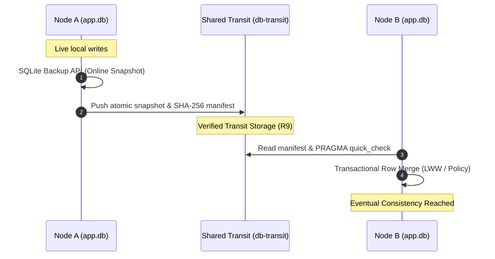

# sqlite-transit-sync

[English](README.md) | [Deutsch](README_de.md)

[](LICENSE)
[](https://www.python.org/)
[](#part-of-the-ellmos-stack-family)
[](#tests)
[](llms.txt)

Local-first synchronization for independent SQLite databases through verified
snapshots and application-selectable merge policies. It is extracted from the
BACH ProSync architecture without BACH, OneDrive, host-name, or user-path
dependencies.

This is **not a distributed SQL server**. Every node owns and opens only its
local database. A shared folder, object-store mount, removable drive, or other
file transport carries closed snapshots plus manifests. Pulling verifies and
merges a snapshot into the local database inside one transaction.

Pairs well with [sync-master](https://github.com/dev-bricks/sync-master)
(same module family): a sync-master yard is a natural transit transport —
point `--transit` at a tool-owned `db-transit/<namespace>/` zone inside the
yard (its protocol rule R9). sync-master carries the documents, this module
owns database integrity and merging; both stay independent.

## Architecture & Data Flow



## Part of the ellmos stack family

`sqlite-transit-sync` is a companion to
[dev-bricks/sync-master](https://github.com/dev-bricks/sync-master) in the
same module family: sync-master owns file transport (`sync.files`), this
module owns database integrity and merging (`sync.database`). Both work
standalone or composed into stacks from the
[ellmos-ai](https://github.com/ellmos-ai) family — see the
[ellmos-ai/stacks](https://github.com/ellmos-ai/stacks) catalog. Its role in
that toolkit: no live SQLite over file-sync — only verified snapshots plus
application-selectable merge policies.

## What it provides

- consistent online snapshots through SQLite's backup API;
- atomic publication using a temporary file and `os.replace`;
- SHA-256 manifest and `PRAGMA quick_check` verification;
- per-node local pull state and idempotent replay;
- row-level last-write-wins per primary key for timestamped tables;
- shared-column merge for basic schema drift tolerance;
- configurable table exclusion and snapshot redaction with post-delete VACUUM;
- custom `MergePolicy` support for domain rules, tombstones or CRDTs;
- dependency-free Python API and JSON CLI.

## Install

```bash
python -m pip install -e .
```

## Quick start

Create a config on every node. Each node uses its own database and state file,
but the same transit directory and namespace.

```bash
sqlite-transit-sync init \
  --config node.json \
  --database ./app.db \
  --transit ./shared-transit \
  --node-id laptop \
  --namespace my-app

sqlite-transit-sync push --config node.json
sqlite-transit-sync pull --config node.json --dry-run
sqlite-transit-sync pull --config node.json
sqlite-transit-sync status --config node.json
sqlite-transit-sync verify --config node.json
```

The application schema must already exist on each node. Automatic first-copy
is intentionally disabled because a generic module cannot decide which schema,
secrets, local tables or migrations belong to an application.

## Configuration

```json
{
  "database": "./app.db",
  "transit": "./shared-transit",
  "state": "./node-state.json",
  "node_id": "laptop",
  "namespace": "my-app",
  "timestamp_columns": ["updated_at", "modified_at", "created_at"],
  "exclude_tables": ["secrets", "sqlite_sequence"],
  "snapshot_exclude_tables": ["secrets"]
}
```

Relative paths are resolved from the config file. The live database must never
be located inside the transit directory.

## Python API

```python
from sqlite_transit_sync import SyncConfig, TransitSync

sync = TransitSync(SyncConfig.from_file("node.json"))
snapshot = sync.push()
reports = sync.pull()
print(snapshot.sha256, [report.as_dict() for report in reports])
```

Pass an object implementing `MergePolicy.merge(local, remote, snapshot)` to
`TransitSync` when timestamp LWW is not sufficient.

## Comparison with distributed SQL

| Aspect | `sqlite-transit-sync` | Distributed SQL, for example CockroachDB or YugabyteDB |
|---|---|---|
| Basic model | Every node owns an independent local SQLite database | All servers form one logical SQL database |
| Writes | Local first, synchronized later | Coordinated directly by the cluster |
| Synchronization | Asynchronous snapshot pull and row merge | Continuous replication between cluster nodes |
| Consistency | Eventual consistency after successful exchange | Usually strong or serializable consistency |
| Consensus and quorum | None required | Usually Raft-based majority consensus |
| Global transactions | No | Yes, including transactions spanning nodes or shards |
| Conflict handling | Application-specific `MergePolicy`; timestamp LWW is the default | Transactions, MVCC, locking and consensus |
| Offline operation | A node can continue reading and writing independently | Writes normally require a reachable quorum |
| Network outage | Local work continues; synchronization waits | Minority partitions may lose write availability |
| Failure handling | Local databases remain usable; transit and backups need separate protection | Replication and automatic failover while quorum remains available |
| Data visibility | Changes become shared after push and pull | Committed changes are immediately authoritative in the cluster |
| Schema changes | The application migrates every local database | Cluster-wide SQL migrations |
| Deletions | Require tombstones or a custom policy | Normal transactional SQL deletes |
| Infrastructure | Python, SQLite and a configurable file transport | Multiple permanent database servers, TLS, monitoring and backups |
| Minimum always-on servers | None; one node is sufficient | Commonly at least three for fault tolerance |
| Primary strength | Offline-first simplicity, low cost and domain-specific merge rules | Strong consistency, concurrent writers and high availability |
| Primary limitation | No global ACID transaction or immediate shared truth | Considerably higher operational complexity and resource use |

### Advantages, disadvantages and typical use cases

| System | Advantages | Disadvantages | Good use cases | Poor use cases |
|---|---|---|---|---|
| `sqlite-transit-sync` | Very small footprint; works offline; no central server; local privacy; transport-independent; merge rules can follow the application domain | Delayed visibility; application-owned conflict, deletion, clock and migration semantics; no global ACID; no quorum failover | Personal knowledge and task databases; local AI agents; laptop/workstation/server exchange; field and edge applications; desktop software with optional synchronization; research notes | Payments, scarce inventory, seat reservations, real-time collaboration on the same records, or many concurrent writers |
| Distributed SQL | Shared authoritative database; strong consistency; global transactions; coordinated concurrent writes; automatic replication and failover; horizontal scaling | Requires permanent servers, networking, certificates, monitoring and upgrades; quorum can reduce write availability during partitions; higher latency and cost | Financial and booking systems; SaaS platforms; e-commerce inventory; global accounts; multiplayer backends; high-availability enterprise services | Small personal tools, intermittently connected devices, single-user desktop applications, or workloads already handled reliably by local SQLite |

### Quick decision guide

| Requirement | Prefer |
|---|---|
| Nodes must keep working offline | `sqlite-transit-sync` |
| Updates may become visible after a synchronization step | `sqlite-transit-sync` |
| Data should remain local and conflicts are infrequent | `sqlite-transit-sync` |
| Many clients modify the same records concurrently | Distributed SQL |
| Every commit must be globally authoritative immediately | Distributed SQL |
| Global transactions or automatic cluster failover are mandatory | Distributed SQL |

For a small number of intermittently connected personal or edge devices,
`sqlite-transit-sync` is usually the simpler fit. A central PostgreSQL service
is often the next step when real concurrent writers appear. Distributed SQL
becomes compelling when strong consistency must also survive server failures
across several permanently operated nodes.

## Safety and limits

- Never open a live SQLite database from a network or cloud-sync folder.
- SHA-256 detects corruption but does not authenticate a hostile transport.
- Default LWW assumes comparable timestamps and does not infer deletions.
- Equal timestamps converge through a deterministic content tie-breaker; this is a
  technical fallback, not a substitute for domain conflict rules.
- Tables without a primary key or timestamp column are skipped.
- Snapshot redaction deletes listed tables and VACUUMs the snapshot, but it must
  still list every table containing credentials or private data; the generic
  module cannot discover domain secrets reliably.
- Application migrations, clock policy, retention and conflict semantics stay
  with the integrating application.
- Run only one sync process per node unless the host application adds a process lock.

See [ARCHITECTURE.md](ARCHITECTURE.md), [README_de.md](README_de.md) and
[SECURITY.md](SECURITY.md).

## Machine-Readable Index

For AI agents, LLMs, and automated tools, a structured sitemap and API index is available at [llms.txt](llms.txt).

## Tests

```bash
python -m unittest discover -s tests -v
```

## Provenance

Extracted in 2026 from BACH `system/hub/db_sync.py` (ProSync). The standalone
module replaces BACH-specific paths, handlers, secrets and table assumptions
with configuration and policy interfaces. It also merges per primary key and
adds verified manifests.

MIT — see [LICENSE](LICENSE).
